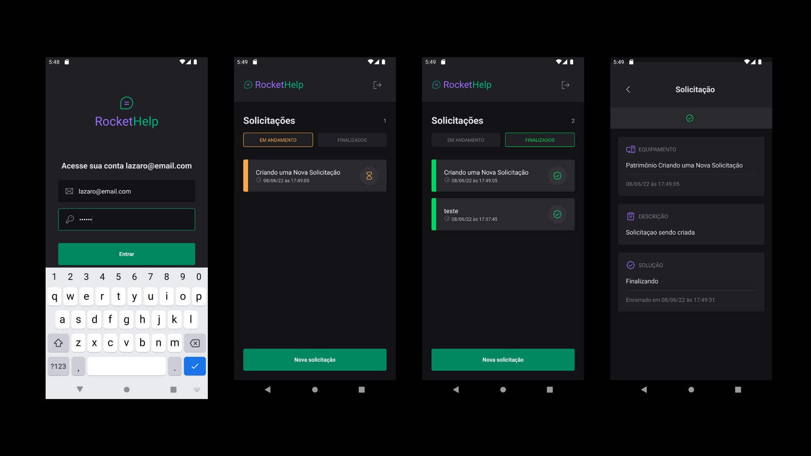

# Primeira Aplicação React Native - Aprendizado

# Desenvolvendo a RocketLabe

Aplicativo que gerencia uma lista de solicitações.

Resumo do Desenvolvimento:

- Iniciação com Expo
- Configuração de Ambiente
- Estilização com Native Base.
- Utilização de fontes externas.
- Alerts
- Props
- Typescript
- Conceitos Hooks
- Navegação
- Native SVG
- Formatação de Data
- DTOs
- Renderização Condicional.
- Integração e Autenticação do Firebase.



## Demonstração em vídeo
[Demonstração em vídeo - Clique Aqui](https://www.linkedin.com/posts/lazarobonfim_resultado-da-aplica%C3%A7%C3%A3o-rockethelp-n%C3%A3o-conseguir-activity-6961749772013613056-AFE9?utm_source=linkedin_share&utm_medium=member_desktop_web)

## Primeiros passos
-   Instale Expo Cli no terminal (se for a primeira vez)
````bash
yarn global add expo-cli

or

npm install -g expo cli
````
-   Instale o Expo Go no Android.
-   Crie projeto usando o comando `expo init <nomeDoProjeto>`
-   Apareca uma lista de opções. A opção Bareflow oferece o minimo para desenvolver para ambientes nativos.
-   Altere o tipo do arquivo App.js para `App.tsx`
-   Após criar um projeto, neste projeto cria um arquivo `tsconfig.json`
-   Execute o commando `expo start`, ele tambem vai perguntar se irá usar o typescript

#### Arquitetura das Pastas

Como no Reactjs, o React Native é semelhante. Cria se a pasta `src` onde ficará os nossos recursos que iremos criar.
Dentro desta criamos uma pasta `screen` onde ficará nossas telas

#### NativeBase

NativeBase é uma biblioteca de componentes que permite que os devs construam sistemas de design universais. Ele é construído em cima do React Native, permitindo que você desenvolva aplicativos para Android, iOS e web. [Página de Instalação](https://docs.nativebase.io/?utm_source=HomePage&utm_medium=Hero_Fold&utm_campaign=NativeBase_3)

*   Instale react-native-svg com expo
    *   expo install react-native-svg
*   Instale react-native-safe-area-context
    *   expo install react-native-safe-area-context

#### Usando Fonts Externas
É necessário instalar as fontes que queremos na nossa aplicação. O carregamento das fontes são assíncronas.

Para instalar
*   expo install expo-font @expo-google-fonts/(Nome da Fonte)

[Documentação](https://docs.expo.dev/guides/using-custom-fonts/)

#### React-native-svg-transformer

O React Native não reconhece SVG, sendo necessário instalar uma biblioteca.

`yarn add --dev react-native-svg-transformer`

[Documentação](https://github.com/kristerkari/react-native-svg-transformer)

Dentro do arquivo `metro.config.js` o conteúdo deve ser substituido pelo conteúdo que está na documentação do react-native-svg-transformer

Também é preciso tipifica o SVG, criando a pasta `@types` e dentro dela o arquivo `svg.d.ts`

#### Phosphor Icon
É um biblioteca de ícones que pode ser usada no React Native, React e etc.

Install `yarn add phosphor-react-native`

## Estrutura visual e Navegação

### VStack e HStack
*   VStack empilha os elementos verticalmente
*   HStack empilha os elementos horizontalmente

### Types Props Native
Alguns elementos são tipificados pelo proprio Native
~~~~javascript
import React from 'react'
import {Button as ButtonNativeBase, IButtonProps, Heading} from 'native-base'

type Props = IButtonProps & {   
  title: string;
}

export function Button({title, ...rest}: Props) {
  return ( 
....
~~~~
### UseState sem/com parametros - um detalhe.
Sempre quando quer executar uma função em uma interação, e essa função passa um parametro, o código deve ser escrito dessa forma 
~~~~javascript
    onPress={() => setStatusSelected('open')}
~~~~
Sem parametro...
~~~~javascript
onPress={setStatusSelected}
~~~~

### React-Navigation
Biblioteca de Rotas e Navegação para aplicações em Expo e React Native

`yarn add @react-navigation/native`

Dependencias da biblioteca

`yarn add react-native-screens react-native-safe-area-context`


Estratégia de Navegação do react-navigation em pilha (abrir uma janela de navegação sobre outra)

`yarn add @react-navigation/native-stack`

#### Aplicando React Navigation
A aplicação é semelhante no React-RouterDom.

~~~~javascript
import { createNativeStackNavigator } from '@react-navigation/native-stack'

import Home from '../screens/Home'
import Details from '../screens/Details'
import Register from '../screens/Register'

const {Navigator, Screen} = createNativeStackNavigator()

export function AppRoutes() {
  return(
    <Navigator screenOptions={{headerShown: false}}>
      <Screen name="home" component={Home}/>
      <Screen name="new" component={Register}/>
      <Screen name="details" component={Details}/>
    </Navigator>
  )
}
~~~~

#### Aplicando a navegação dentro de um contexto
~~~~javascript
import {NavigationContainer} from '@react-navigation/native'

import { SignIn } from '../screens/SignIn';
import {AppRoutes} from './app.routes';

export function Routes() {
  return(
    <NavigationContainer>
      <AppRoutes/>
    </NavigationContainer>
  )
}
~~~~

##  Integração com Firebase e finalização

#### Instalando o Firebase

[O firebase tem uma documentação apropriada para React Native](https://rnfirebase.io/)

`yarn add @react-native-firebase/app`

Com o expo podemos utilizar plugins que automatizar algumas configurações do firebase

~~~~json
    "plugins": [
      "@react-native-firebase/app"
    ],
~~~~

Depois é preciso registar o App no firebase e fazer o download do `google-services.json` para Android, e do `GoogleService-info.plist` para IOS.

Em seguida colocar esses arquivos no raíz do projeto e adiciona ao `app.json`

~~~~json
...
    "android": {
      "package": "com.rockethelp",
      "googleServicesFile": "./google-services.json"
    },
    "ios" : {
      "bundleIdentifier": "com.rockethelp",
      "googleServicesFile":"./GoogleService-info.plist"
    }
~~~~
Execute o comando `expo prebuild` e assim ela prepara automaticamente a aplicação para o firebase

### Instalação do Modulo Firebase
`yarn add @react-native-firebase/installations`

### Autenticação Firebase

Install the authentication module
`yarn add 
@react-native-firebase/auth`


### Aplicação da Auth no código

Função de SignIn - onde o usuário faz o login no App.

~~~~javascript
'src\screens\SignIn.tsx'

  function handleSignIn() {
    if(!email || !password){
      return Alert.alert("Entrar", "Informe e-mail e senha");
    }

    setIsLoading(true);

    auth().signInWithEmailAndPassword(email, password)
    .then(response => {
      console.log(response)
    })
    .catch((error)=>{
      console.log(error)
      setIsLoading(false)

      if(error.code === 'auth/invalid-email'){
        return Alert.alert('Entrar', 'E-mail ou senha inválida.');
      }

      if(error.code === 'auth/wrong-password'){
        return Alert.alert('Entrar', 'E-mail ou senha inválida.');
      }
      if(error.code === 'auth/user-not-found'){
        return Alert.alert('Entrar', 'Usuário não cadastrado.');
      }
      return Alert.alert('Entrar', 'Não foi possível acessar')
    })
  }
~~~~

Caso o usuário é autenticado, ele é levado para a tela Home.

~~~~javascript
'src\routes\index.tsx'

import {NavigationContainer} from '@react-navigation/native'
import auth, {FirebaseAuthTypes} from '@react-native-firebase/auth'
import { useState, useEffect } from 'react';
import { SignIn } from '../screens/SignIn';
import {AppRoutes} from './app.routes';
import { Loading } from '../components/Loading';

export function Routes() {
  const [loading, setIsLoading] = useState(true);
  const [user, setUser] = useState<FirebaseAuthTypes.User>()

  useEffect(() => {
    const subscriber = auth()
    .onAuthStateChanged(response => {
      setUser(response)
      setIsLoading(false)
    });

    return subscriber;
  }, []);

  if(loading) {
    return <Loading/>
  }

  return(
    <NavigationContainer>
      {user? <AppRoutes/> : <SignIn/>}
    </NavigationContainer>
  )
}
~~~~

### Criando/Enviando Registros para Firestore.

Ao fazer Nova Solicitação, é levado para outra página em que você dar a description e o título.
Essa informações são armazenadas nos dados juntamente com o horário em que é criado.

~~~~javascript
'src/screen/Register'
....
function handleNewOrderRegister() {
    if (!patrimony || !description) {
      return Alert.alert('Registrar', 'Preencha todos os campos.');
    }

    setIsLoading(true);

    firestore()
      .collection('orders')
      .add({
        patrimony,
        description,
        status: 'open',
        created_at: firestore.FieldValue.serverTimestamp()
      })
      .then(() => {
        Alert.alert("Solicitação", "Solicitação registrada com sucesso.");
        navigation.goBack();
      })
      .catch((error) => {
        console.log(error);
        setIsLoading(false);
        return Alert.alert('Solicitação', 'Não foi possível registrar o pedido');
      });
  }
~~~~
Nessa Parte é onde definimos os tipos de informações que serão criadas. `firestore.FieldValue.serverTimestamp()` pega o horário em que é criado/registrado.
~~~~javascript
    firestore()
      .collection('orders')
      .add({
        patrimony,
        description,
        status: 'open',
        created_at: firestore.FieldValue.serverTimestamp()
      })
~~~~

### Renderizando os dados na Home

O metodo onSnapshot atualiza os dados em tempo real.


~~~~javascript
  useEffect(() => {
    setIsLoading(true)

    const subscriber = firestore()
    .collection('orders')
    .where('status', '==', statusSelected)
    .onSnapshot(snapshot => {
      const data = snapshot.docs.map(
        doc =>{
          const {patrimony, description, status, created_at} = doc.data()

          return {
            id: doc.id,
            patrimony,
            description,
            status,
            when: dateFormat(created_at)
          }
        }
      )
      setOrders(data)
      setIsLoading(false)
    })
    return subscriber

  }, [statusSelected])
~~~~

`dateFormat` foi criado para adaptar o tempo para o javascript.
~~~~typescript
import { FirebaseFirestoreTypes } from "@react-native-firebase/firestore";

export function dateFormat(timestamp: FirebaseFirestoreTypes.Timestamp) {
  if(timestamp) {
    const date = new Date(timestamp.toDate());

    const day = date.toLocaleDateString('pt-BR');
    const hour = date.toLocaleTimeString('pt-BR');


    return `${day} às ${hour}`;
  }
}
~~~~

### DTOs
Data Transfer Object (DTO) ou simplesmente Transfer Object é um padrão de projetos bastante usado em Java para o transporte de dados entre diferentes componentes de um sistema, diferentes instâncias ou processos de um sistema distribuído ou diferentes sistemas via serialização.

A ideia consiste basicamente em agrupar um conjunto de atributos numa classe simples de forma a otimizar a comunicação.

~~~~javascript
import { FirebaseFirestoreTypes } from "@react-native-firebase/firestore";

export type OrderFirestoreDTO = {
  patrimony: string;
  description: string;
  status: 'open' | 'closed',
  solution?: string;
  created_at: FirebaseFirestoreTypes.Timestamp;
  closed_at?: FirebaseFirestoreTypes.Timestamp;
}
~~~~
